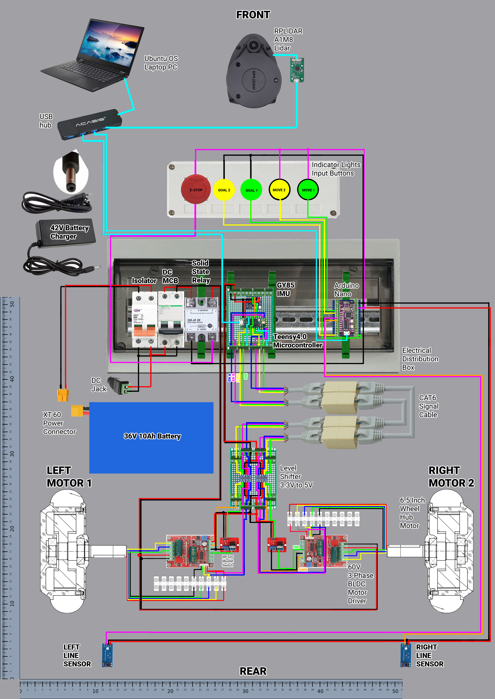

# ROS2 Auto Move Program
Objective of this program is to command a ROS2 robot to move after receiving button input. A simple ROS2 auto-move-to-(x,y)location-pause-then-return-dock with move-button, IR sensor input and light indicator output using Arduino Nano [Pyfirmata](https://pypi.org/project/pyFirmata/). Program tested on Linorobot2 ROS2 Humble. 

Reference, https://github.com/ros-planning/navigation2/tree/main/nav2_simple_commander

## How to use AutoMoveProgram

    chmod +x /home/oto/Documents/otomoov.py

Check if otomoov.py is executable

    ls /dev/tty*

Launch otomoov.py

    ros2 launch linorobot2_bringup bringup.launch.py
    ros2 launch linorobot2_navigation navigation.launch.py rviz:=true map:=/home/oto/linorobot2/linorobot2_navigation/maps/mapName.yaml
    python3 /home/oto/Documents/otomoov2.py

## Mapping & Navigation Quick Step

Mapping / SLAM

    ros2 launch linorobot2_bringup bringup.launch.py
    ros2 launch linorobot2_navigation slam.launch.py rviz:=true
    ros2 run teleop_twist_keyboard teleop_twist_keyboard
    cd linorobot2/linorobot2_navigation/maps
    ros2 run nav2_map_server map_saver_cli -f mapName --ros-args -p save_map_timeout:=10000.

Navigation / AutoMoveProgram

    ros2 launch linorobot2_bringup bringup.launch.py
    ros2 launch linorobot2_navigation navigation.launch.py rviz:=true map:=/home/oto/linorobot2/linorobot2_navigation/maps/mapName.yaml
    python3 /home/oto/Documents/example_nav_to_pose.py

## Pyfirmata Issue-Solution

    sudo apt remove brltty
    pip install pyfirmata
    sudo adduser yourusername dialout
    ls /dev/tty*

